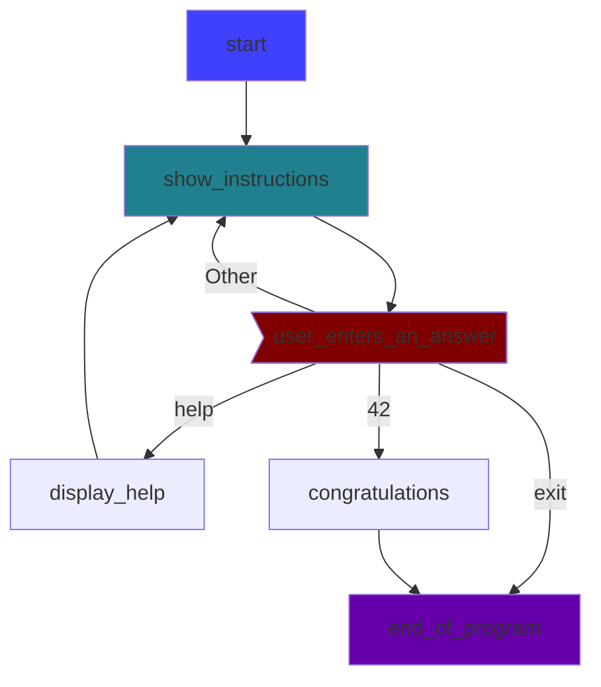
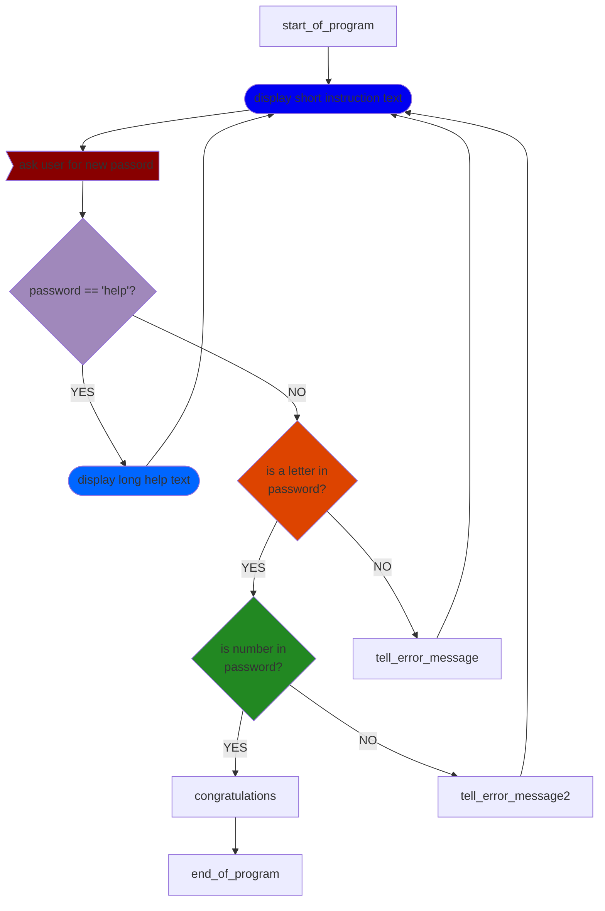

note to dasha:

ukrainian version of byte of python is online: 
https://spielend-programmieren.at/byte_of_python_ukraine/

## Tasks for chapter _Basic_:

### Task 1
 * Create a variable with the name `sentence` and assign it the value of a string with eleven words in it. (any words).
 * Print out (the value of the variable) `sentence`. 
 * add this code line to the end of your program:

```python
print(len(sentence.split()))
```

*Hint*: Python's `split()`-function counts the words in a string by counting the spaces between the words, so the exact task is: "write words with 9 spaces between them"


**possible solution**
```python
# chapter basic, solution for task 1
sentence = "roses are red, violets are blue, i'm shizophrenic and me too"
print(sentence)
print(len(sentence.split()))
```

 

### Task 2
 * Create a variable with the name `poem` and assign a string with some words to it.
 * The string shall span over three text lines.
 * Print out the value of the variable `poem`.
 * Add this code line to the end of your program:
```python 
print(len(poem.splitlines()))
```

Can you solve this task (that the string spans over several lines) in different ways?

*possible solutions:*

```python
# solution for chapter basic,  task 2, variant A
poem="""one
two
three"""
print(poem)
print(len(poem.splitlines()))
```

```python
# solution for chapter basic,  task 2, variant B
poem='one\ntwo\nthree'
print(poem)
print(len(poem.splitlines()))
```

```python
# solution for chapter basic,  task 2, variant C
poem="\n".join(["one","two","three"])
print(poem)
print(len(poem.splitlines()))
```


### Task 3
 * Create a variable with the name `salary` and assign the value of `4000` to it.
 * Print the value of `salary` 

*possible solutions*

```python
# solution for chapter basic,  task 3, variant A
# most common variant
salary = 4000
print(salary)
```
```python
# solution for chapter basic,  task 3, variant B
# use underscores for better readability
salary = 4_000
print(salary)
```

### Task 4
 * Create a variable with the name `income` and assign the the value of `4000` to it.
 * Create a variable named `output`. The value of `output` should be this string: "My income is X Euro per month".
 * Modify the code so that Python replaces `X` with the value of the variable `income`.
 * print out the value of `output`

Can you solve this task in different ways?


*possible solutions:*

```python
# solution for chapter basic,  task 4, variant A
# using .format()
income=4000
output = 'My income is {} Euro per month'.format(income)
print(output)
```

```python
# solution for chapter basic,  task 4, variant B
# using f-strings
income=4_000
output = f'My income is {income} Euro per month'
print(output)
```

```python
# solution for chapter basic,  task 4, variant C
# using str()
income = 4000
output = 'My income is' + str(income) + 'Euro per month'.format(income)
print(output)
```

```python
# solution for chapter basic,  task 4, variant D
# using %
income=4000
output = 'My income is %i euro per month' % income
print(output)
```


### task 5
 
identifiers for variables

Which of these names are valid *identifiers* for *variables* in Python?

1) `a`
2) `A`
3) `aaaa`
4) `a123`
5) `123a`
6) `_123a`
7) `_a123`
8) `a_123`
9) `1_a23`
10) `!abc`
11) `a-b`
12) `a_minus_b`

*Correct answers*: 
1,2,3,4,6,7,8,12


## Tasks for chapter _Operators and Expressions_:

### task 1

Which of these Python *expressions* evaluate to `True`?
1)  `True == False`
2)  `True == True`
3)  `False == False`
4)  `5 > 2`
5)  `len("Michael") > len("Mike")`
6)  `5 != 7`
7)  `6 >= 6`
8)  `"abc" * 3 == "abcabcabc"`
9)  `5**2 == 25`
10) `0 == False`
11) `1 == True`
12) `2 == True`
13) `2 == False`
14) `True == 1`
15) `None == None`
16) `None != 0`
17) `None == ""`

*Correct answers*: 
2,3,4,5,6,7,8,9,10,11,14,15,16 

### task 2

Which of the following Python *expressions* evalute to `False` ?

1) `10 / 5 == 2.0`
2) `10 // 5 == 2`
3) `10 % 3 == 1`
4) `( 5 > 1) and ( 5 > 7)`
5) `( 5 > 1) or (5 > 7)`
6) `not (5 > 7)`

*Correct answer(s)*: 4

### task 3

* What will be the output (the value of the variable `x`) of this Python program? 

```python
# problem chapter op-expr, task 3
x = 5
x = 5+1
x += 1
x = x * 2
x /= 2
print(x)
```
*Correct answer*: 
`7.0`


TODO: questions for bit operations 


## Tasks for chapter Control Flow 

### task 1

In the tasks for this chapter, use (some of the) Python *statements* described in the chapter "Control flow" (like `if`, `elif`, `else`, `for`, `while`, `continue`, `break`)

 * Write a program that let the enter a password and gives an answer about a password:
   * If the password is `SeCrEt`, the program shall print `Correct` and exit.
   * If the user enters a wrong password, the program prints `Wrong` and ask again for a passwort
 * After 3 failed attempts, the program prints `You failed 3 times` and exit.
 * Before the program ends, it should print `bye!`

*Example output*:
```
Please enter password: >>>secret
Wrong
Please enter password: >>>Secret
Wrong
Please enter password: >>>SeCrEt
Correct
bye!
```

*possible solutions*:
```python
# solution for chapter control flow,  task 1, variant A
for a in range(3):
    text = input("Please enter password: >>>")
    if text == "SeCrEt":
        print("Correct")
        break
    else:   
        print("Wrong")
else:
    print("You failed 3 times")
print("bye!")
```

```python
# solution for chapter control flow,  task 1, variant B
for _ in range(3):
    if input("Please enter password: >>>") == "SeCrEt":
        print("Correct")
        break
    print("Wrong")
else:
    print("You failed 3 times")
print("bye!")
```

```python
# solution for chapter control flow,  task 1, variant C
attempt = 1
max_attempts = 3
valid_password = "SeCrEt"
while True:
    print(f"this is attempt {attempt} of {max_attempts}")
    text = input("Please enter password: >>>")
    if text == valid_password:
        print("Correct")
        break
    else:
        print("Wrong")
    attempt += 1
    if attempt > 3:
        print("You failed 3 times")
        break
print("bye!")
```

```python
# solution for chapter control flow,  task 1, variant D
attempt = 0
while attempt < 3:
    attempt += 1
    if input("Please enter password: >>>") == "SeCrEt":
        print("Correct")
        break
    print("Wrong")
else:
    print("You failed 3 times")
print("bye!")
```

```python
# solution for chapter control flow,  task 1, variant E
attempt = 1
while input("Please enter password: >>>") != "SeCrEt":
    print("wrong")
    attempt += 1
    if attempt > 3:
        print("You failed 3 times")
        break
else:
    print("correct")
print("bye!")
```

### task 2
The program below does not work as intented. 
What the program *should* do:

* The program should let the enter a password.
* If the user enters the correct password (`secret`) the program should print `correct` and exit
* If the user enters a wrong password, the program should ask again
* if the user enters 3 times a wrong password, the program should write `You failed 3 times` and exit."

Your tasks after analyzing the program:
  * Find out why this program does not work as intended.
  * Make a proposal of how to modify the program so that it works as intended


``` python
# problem  control flow,  task 2, 
password = "secret"
max_attempts = 3
attempt = 1
while attempt < max_attempts:
    print(f"Attempt {attempt} of {max_attempts}")
    guess = input("enter password: >>>")
    if guess == password:
        print("correct")
        break
    attempt += 1
else:
    print("You failed 3 times")
print("bye")
```

*solution*: 
  * The problem is in line 5.
  * Correction of line 5: ```while attempt <= max_attempts:```

### Task 3

Please correct the program below so that it gives only one answer.

``` python
# problem control_flow task 3
income = input("please enter your monthly (netto) income in €")
income = int(income)
if income < 1000:
    print("you do not earn much...")
if income < 2000:
    print("it could be better....")
elif income < 3000:
    print("nice")
if income < 4000:
    print("very nice")
if income < 5000:
    print("fantastic")
else:
    print("really??")
``` 


Solution:
``` python
income = input("please enter your monthly (netto) income in €")
income = int(income)
if income < 1000:
    print("you do not earn much...")
elif income < 2000:
    print("it could be better....")
elif income < 3000:
    print("nice")
elif income < 4000:
    print("very nice")
elif income < 5000:
    print("fantastic")
else:
    print("really??")

``` 

### Task 4 
Exercises for "for loop" and "range"

 * Read the python documentation about the `range` command: https://docs.python.org/3/library/stdtypes.html#range
To understand the parameters `start`, `stop` and `step`.

Try to solve this answers without using a computer:
What will be the output of this python *statement* ?
```python
print(list(range(5)))
``` 

*Solution*: The ouput will be: ```[0,1,2,3,4]```
 
### Task 5
write a Python statement (using `range`) to produce this output:
`[1,2,3,4,5]`

*Solution*:
```python
# solution control flow, task 5
print(list(range(1,6)))
```
### Task 6

write a Python statement (using `range`) to produce this output:
`[10,20,30,40,50]`

*Solution*:
```python
# solution control flow task 6
print(list(range(10,51,10)))
```

### Task 7
write a Python statement (using `range`) to produce this output: `[50,40,30,20,10,0]`

*Solution*:
```python
# solution control flow task 7
print(list(range(50,-1,-10)))
```

### Task 8
write a Python statement (using `range`) that prints all number from 1 to 10. Each number shall be printed in a separate line

*Solution*:
```python
# solution control flow task 8
for x in range(1,11):
    print(x)
```

### Task 9 
write a Python statement (using `range`) that prints all number from 1 to 10 in a single line. The numbers schuld be seperated by a comma.
(There can be a trailing comma after the last number)

*Solution*:
```python
# solution control flow task 9
for x in range(1,11):
    print(x, end=",")
```

### Task 10
6.7. Write a Python program (using the `range` statement) that multiplies each number between 2 and 5 with every other number in that range. 
The program should print a separate line for each calculation, like in this (truncated) example:  :
```
 2 x 2 =  4 
 2 x 3 =  6 
 2 x 4 =  8 
 2 x 5 = 10 
 3 x 2 =  6 
 3 x 3 =  9
 ...
``` 

*Solution*
```python
# solution chapter control flow,  task 10
for a in range(1,6):
    for b in range(1,6):
        print(f"{a} x {b} = {a*b:>2}")
```
### Task 11

6.8. How many lines will this python program print?
``` python
# problem control flow task 11
for x in "abcde":
    for y in "wxyz":
        print(x,y)
```

*Solution*: 20 lines
        
### Task 12
How many lines will this Python program print?
``` python
# problem control flow task 12
for a in ("abc","def","ghi"):
    for b in (100,200,300,400):
        for c in "yz":
            print(a,b,c)
```

*Solution*: 24 lines

### Task 13
Why will this program not work ?
``` python
# problem control flow task 13
for a in range(-10,11):
    for b in range(-10,11):
        print(f"{a} + {b} = {a+b}")
        print(f"{a} - {b} = {a-b}")
        print(f"{a} x {b} = {a*b}")
        print(f"{a} / {b} = {a/b}")
```         
        
*Solution*: Because of a division by zero error in line 6 
The line 6 : `print(f"{a} / {b} = {a/b}")`
tries to divide a by b. But b comes from `range(-10, 11)`, which includes 0.

## task 14

please read in "Byte of Python", chapter "Control flow" about the commands `break` and `continue`. (Both commands can exist inside a `while` loop or inside a `for` loop.) 
Also check if you understand the official python documentation about those commands: 
https://docs.python.org/3/tutorial/controlflow.html#break-and-continue-statements

If you feel that you understood the usage of `break`and `continue`, analyse this program (the program works correctly):

```python
# problem control flow task 14 A
while True:
    print("What is the answer to THE question?")
    print("type 'help' to see a help text")
    print("type 'quit' to exit this game")
    command = input(">>>")
    if command == "help":
        print("See 'The hitchhikers guide to the galaxy")
        print(" by Douglas Adams")
    elif command == "quit":
        break
    elif command == "42":
        print("Congratulations, you know THE answer")
        print("But what was the question exactly..... ? ")
        break
    
print("bye-bye")
```

 * Try to understand what the program does (try it out).
 * Try to understand this program by not looking only at the code, but also by looking at the flowchart of this program:



Read more about flowcharts in Wikipedia: https://en.wikipedia.org/wiki/Flowchart

You can create flowcharts with pen and paper, or with the help of computer programs (like MS Word or libre office draw). This flowchart above was made with the charting tool "mermaid". See https://mermaid.js.org for documentation and online editor.


 * Analyze the Python program below
 * Create a flowchart for it ! (using any tool of your choice)

```python
# problem control flow task 14 B
# password creation

while True:
    print("type 'help' to display a help text")
    command = input("please enter a new password >>>")
    if command == "help":
        print("The password must have: ")
        print("At least one digit (0-9) ")
        print("At least one lower-case character (a-z)")
        continue
    # test the password

    for char in "abcdefghijklmnopqrstuvwxyz":
        if char in command:
            break
    else:
        print("no lowercase character (a-z) found. please try again")
        continue

    for number in "0123456789":
        if number in command:
            break
    else:
        print("no digit (0-9) found. please try again")
        continue
    print("Congratulation, your password is accepted")
    break
print("bye bye")
```

*possible solution* 



## Tasks for chapter _Function_:

### Task 1 

Write a python *function* with the name `greeting`.
The function shall simulate an hotel employee. Given the `hour_of_day` as *parameter* (0 - 24),
the function shall *return* a greeting:

 
| hour from | hour until  | greeting       |
| ---: | ---: |----------------|
| 0 | 6  |  Good night    |
| 6 | 11 | Good morning   |
| 11 | 14 | Good day       |
| 14 | 18 | Good afternoon |
| 18 | 22 | Good evening   |
| 22 | 24 | Good night     |


Add code to test the `greeting` function:
print out every hour from 1 to 24 and the corresponding greeting
for this hour ( one line per hour)

*possible solutions* 
```python
# solution chapter function task 1, variant A
def greeting(time_of_day):
    if 6 <= time_of_day <11:
        return "Good morning"
    elif 11 <= time_of_day < 14:
        return "Good day"
    elif 14 <= time_of_day < 18:
        return "Good afternoon"
    elif 18 <= time_of_day < 22:
        return "Good evening"
    elif (22 <= time_of_day) or (time_of_day <6):
        return "Good night"
# test
for h in range(1,25):
    print(f"hour: {h:>2} greeting: {greeting(h)}")
```

```python
# solution chapter function task 1, variant B
def greeting(hour_of_day):

    #  dictionary: key: hour_of_day value: greeting
    timetable = {6:"Good night",
                 11:"Good morning",
                 14:"Good day",
                 18:"Good afternoon",
                 22:"Good evening",
                 24.1:"Good night", # special case to catch 24
                }
    for key in timetable:
        if hour_of_day < key:
            return timetable[key]

# test
for h in range(1,25):
    print(f"hour: {h:>2} greeting: {greeting(h)}")
```


### Task 2

 * Write a function named `improved_greeting`.
 * The function shall simulate a greeting hotel employee, like in task 1,
 * The function shall have two *parameters*: 
   * `hour_of_day` (a number from 1 to 24) 
   * `gender` ("male" or "female") 
 * The function shall *return* a greeting dependend on the `hour_of_day` (see table in task 1) and the `gender`:
   * add "Sir" if the `gender` is male
   * add "Madam" if `gender` is female
   
examples:
```
Good morning, Sir
Good afternoon, Madam
``` 

Also, like in the previous task, add code to test the function for every hour of the day (0–24) and for both genders (“male” and “female”).

*possible solutions*:

```python
# solution chapter function task 2, variant A
def improved_greeting(hour_of_day, gender):
    suffix = ""
    if gender == "male":
        suffix = ", Sir"
    elif gender == "female":
        suffix = ", Madam"
    if 6 <= hour_of_day <11:
        return "Good morning" + suffix
    elif 11 <= hour_of_day < 14:
        return "Good day" + suffix
    elif 14 <= hour_of_day < 18:
        return "Good afternoon" + suffix
    elif 18 <= hour_of_day < 22:
        return "Good evening" + suffix
    elif (22 <= hour_of_day) or (hour_of_day <6):
        return "Good night" + suffix
# test
for h in range(1,25):
    for g in ("male", "female"):
        print(f"hour: {h:>2} gender: {g:<6} greeting: {improved_greeting(h,g)}")
```

```python
# solution chapter function task 1, variant B
def improved_greeting(hour_of_day, gender):

    suffix = {"male": "Sir",
              "female":"Madam",
              }

    #  dictionary: key: hour_of_day value: greeting
    timetable = {6:"Good night",
                 11:"Good morning",
                 14:"Good day",
                 18:"Good afternoon",
                 22:"Good evening",
                 24.1:"Good night", # special case to catch 24
                }
    for key in timetable:
        if hour_of_day < key:
            return timetable[key] + ", " + suffix[gender]
# test
for h in range(1,25):
    for g in ("male", "female"):
        print(f"hour: {h:>2} gender: {g:<6} greeting: {improved_greeting(h,g)}")
```

### Task 3

Use the example from the previous task (task 2) but make those changes:

 * Rename the function to `complex_greeting`
 * Add an additional *parameter* with the name `child` 
 * Modify the *return values* of the function so that when the value of `child` is `True`, the function shall return "young man" instead of "Sir" and "young lady" instead of "Madam"


Add code to test the function for all combinations of `hour_of_day` (0-24), `gender` ("male", "female") and `child` (True, False)

*possible solutions*:
```python
# solution chapter function task 3, variant A
def complex_greeting(hour_of_day, gender, child):
    suffix = ""
    if gender == "male":
        suffix = ", Sir"
        if child: #  if child == True:
            suffix = ", young man"
    elif gender == "female":
        suffix = ", Madam"
        if child:
            suffix = ", young lady"
    if 6 <= hour_of_day <11:
        return "Good morning" + suffix
    elif 11 <= hour_of_day < 14:
        return "Good day" + suffix
    elif 14 <= hour_of_day < 18:
        return "Good afternoon" + suffix
    elif 18 <= hour_of_day < 22:
        return "Good evening" + suffix
    elif (22 <= hour_of_day) or (hour_of_day <6):
        return "Good night" + suffix
# test
for h in range(1,25):
    for g in ("male", "female"):
        for c in (True, False):
            print(f"hour: {h:>2} gender: {g:<6} child: {str(c):<5} "
                  f"greeting: {complex_greeting(h,g,c)}")
```

```python
# solution chapter function task 3, variant B
def complex_greeting(hour_of_day, gender, child):

    # dictionary: key: gender value: (greeting_adult, greeting_child)
    suffix = {"male": ("Sir","young man"),
              "female":("Madam","young lady"),
              }

    #  dictionary: key: hour_of_day value: greeting
    timetable = {6:"Good night",
                 11:"Good morning",
                 14:"Good day",
                 18:"Good afternoon",
                 22:"Good evening",
                 24.1:"Good night", # special case to catch 24
                }
    for key in timetable:
        if hour_of_day < key:
            return timetable[key] + ", " + suffix[gender][child]
            # True has the value of 1, False has the value of 0
            # Therefore, child can be used as index for first/second element
# test
for h in range(1,25):
    for g in ("male", "female"):
        for c in (True, False):
            print(f"hour: {h:>2} gender: {g:<6} child: {str(c):<5} "
                  f"greeting: {complex_greeting(h,g,c)}")
```

### Task 4

This is a very simple task:

 * Write a function with the name `greeter1`:
   * The function shall have no *parameters* at all
   * The function shall always *return* the *string* "Good morning"

Add code to print out the result of a *function call* to `greeter1`

*solution*
```python
# solution chapter function, task4
def greeter1():
    return "Good morning"

# function call (calling greeter1 without arguments)
print("----- calling greeter1 -------")
print(greeter1())
```

### Task 5

 * create a function with the name `greeter2`:
   * The function shall have one *parameter* with the name `adjective`
   * The default value of `adjective` shall be `"good"`
   * The function shall *return*  a string consisting of the `adjective` and `" Morning"` 
 * Test the function by calling it with different arguments (and without arguments). Always printing the return value when calling the function 

*solution*
```python
# solution function task 5
def greeter2(adjective="good"):
    return adjective + " Morning" 
    
# function call (calling greeter2 with different arguments)
print("---- calling greeter2 -----")
print(greeter2("bad"))
print(greeter2("excellent"))
print(greeter2())
print(greeter2(" "))
```
### Task 6

 * Write a function with the name `greeter3`:
   * The function shall have 2 parameters: `adjective` and `time_of_day` (both are strings)
   * Both parameters shall have default values (like `"good"` and `"morning"`)
   * The function shall return a single string, consisting of the value of `adjective`, a space and the value of `time_of_day`
 * Test the function by calling it with different arguments (and no arguments) for both parameters, and always print out th *return value* of each function call 


```python
# solution function task 6
def greeter3(adjective="good", time_of_day="Morning"):
    return adjective + " " + time_of_day

# function call calling greeter3
print("---- calling greeter3 -----")
print(greeter3())
print(greeter3("bad"))
print(greeter3("bad", "evening"))
print(greeter3(time_of_day= "evening"))
```   

### Task 7

* Write a function with the name `greeter4`:
  * The function shall have one parameter with the name `time_of_day`
  * The default value of `time_of_day` should be `"morning"`
  * The function shall accept ANY number of additional arguments (including zero)
  * The function shall return a string, consisting of all the additional arguments (seperated by comma), a space and the value of `time_of_day` (all parameters are strings)
* Test the function by calling the function several times, each time with a different number of arguments (including without arguments). Print out the return value of each function call. For example, ```print(greeter4("evening", "lovely", "mild", "wonderful"))```

*possible solutions*:

```python 
# solution functions task 7 variant A
# function that accepts any number of parameters and returns them all
def greeter4(time_of_day="Morning", *args):
    text = ""
    for a in args:
        text += a + ","
    if len(args) > 0:
        text = text[:-1]  # remove last comma
        text += " "
    text += time_of_day
    return text

print("------ calling greeter4 ----")
print(greeter4())
print(greeter4("night"))
print(greeter4("evening", "wonderful", "lovely", "heroic", "romantic"))
print(greeter4("night", "good"))
print(greeter4("day", "sunny", "warm", "emotional"))
```
```python
# solution functions task 7 variant B
# function that accepts any number of parameters and returns them all
def greeter4(time_of_day="Morning", *args):
    text = ",".join(args)
    if len(text) > 0:
        text += " "
    text += time_of_day
    return text

print("------ calling greeter4 ----")
print(greeter4())
print(greeter4("night"))
print(greeter4("evening", "wonderful", "lovely", "heroic", "romantic"))
print(greeter4("night", "good"))
print(greeter4("day", "sunny", "warm", "emotional"))
```

### Task 8

* Write a function with the name `greeter5`:
  * The function shall have one parameter with the name `time_of_day`
  * The *default value* of `time_of_day` should be `"morning"`
  * The function shall accept ANY number of additional keyword arguments, for example : `greeter5("morning", air="wonderful", weather="sunny")`
  * The function shall return a multi-line string (see below) that includes all arguments in this form:
    * for the *function call*: `greeter5("morning", air="wonderful", weather="sunny")`
    * The *return value* shall be: `"What a morning!\nThe air is wonderful.\nThe weather is sunny."`
  * Test the function by calling the function several times, each time with a different number of arguments (including without arguments). Print out the return value of each function call. 

**solution**:
```python 
# solution function task 8
def greeter5(time_of_day="morning", **kwargs):
    text = "What a " + time_of_day + "!\n"  # \n makes a new line
    for key, value in kwargs.items():
        text += "The " + key + " is " + value + ".\n"
    return text

print("------- calling greeter5 ---------")
print(greeter5())
print(greeter5(air="wonderful", mood="joyful", future="bright"))
print(greeter5("day", temperature="freezing", wind="strong"))
```

### Task 9

* Write a function with the name `greeter6`:
  * The function shall have one parameter with the name `time_of_day`
  * The *default value* of `time_of_day` should be `"morning"`
  * The function shall accept ANY number of additional arguments (their values are strings), for example: `greeter6("day","good","early","successfull")`
  * The function shall accept ANY number of additional keyword arguments, for example : `greeter6("day", "good", air="wonderful", weather="sunny")`
  * The function shall return a multi-line string (see below) that includes all the arguments and all the keyword-arguments in this form:
    * for the *function call*: `greeter6("morning", "good", "nice", air="wonderful", weather="sunny")`
    * The *return value* shall be: `"What a good, nice morning!\nThe air is wonderful.\nThe weather is sunny."`
  * Test the function by calling the function several times, each time with a different number of arguments and keyword arguments. Print out the return value of each function call. 


```python 
# solution function task 9
def greeter6(time_of_day="morning", *args, **kwargs):
    text = "What a "
    # iterate over *args
    for a in args:
        text += a + ", "
    if len(args) > 0:
        text = text[:-2] + " "
    text += time_of_day + "!\n"
    # iterate over **kwargs
    for key,value in kwargs.items():
        text += "The " + key + " is " + value + ".\n"
    return text

print("------ calling greeter6 ----")
print(greeter6())
print(greeter6("evening"))
print(greeter6("morning", "sunny", "warm", "emotional"))
print (greeter6("morning", "sunny", "warm", "emotional",
                 air="wonderful", mood="joyful", future="bright"))
print(greeter6(air="smelly"))
```

