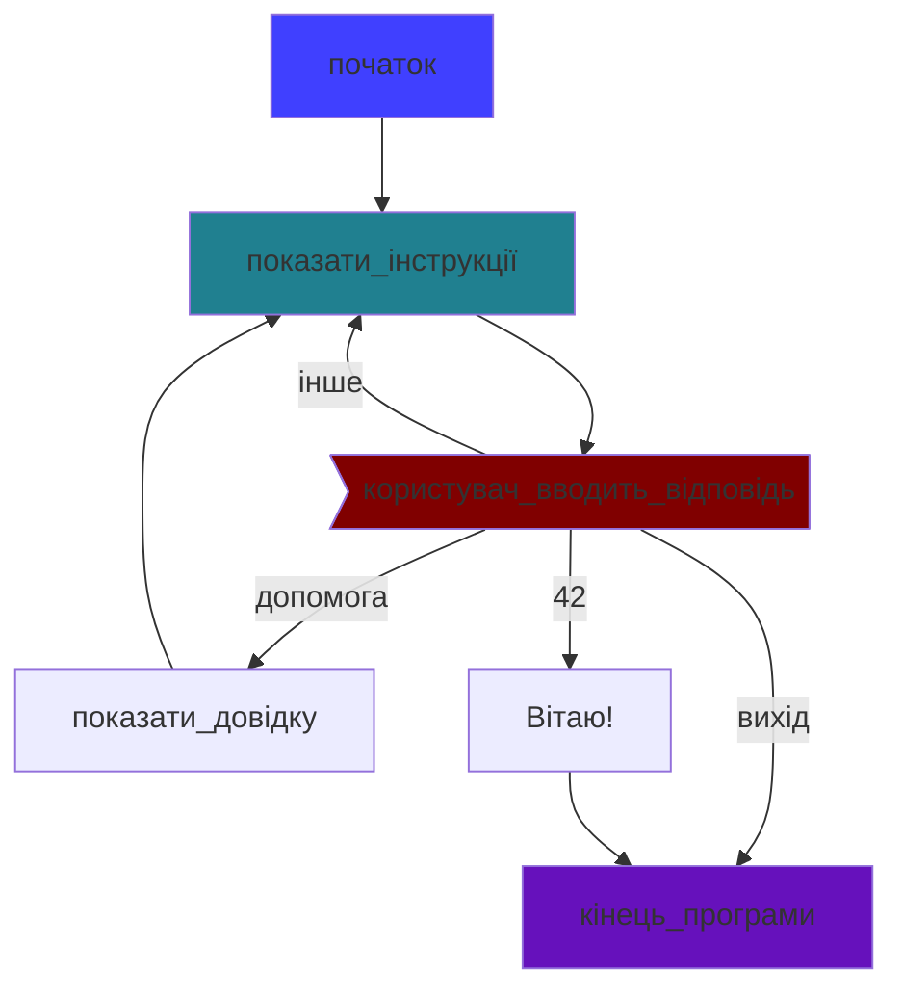
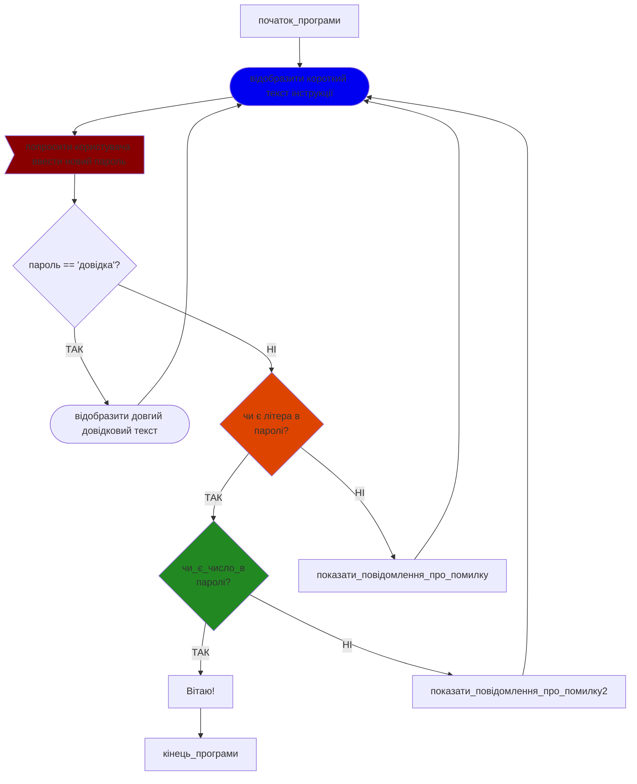

*4note to dasha:

ukrainian version of byte of python is online: 
https://spielend-programmieren.at/byte_of_python_ukraine/

## Завдання до розділу Основи: ( англ._Basic_)

### Завдання 1
 * Створіть змінну з назвою `речення` і присвойте їй значення — рядок, який містить одинадцять слів (будь-яких).
 * Виведіть на екран значення змінної `речення`. 
 * Додайте цей рядок коду в кінці своєї програми:

```python
print(len(sentence.split()))
```


*Підказка*:
Функція split() у Python рахує кількість слів у рядку, підраховуючи кількість пробілів між словами.
Тож завдання звучить так: «напиши слова, між якими є 10 пробілів».

**Можливе рішення**
```python
# Ось приклад рішення для завдання 1 із розділу Основи ("")
речення = "Мова Python дуже цікава, проста і легка для вивчення кожному щодня"
print(речення)
print(len(речення.split()))
```

 

### Завдання 2
 * Створіть змінну з назвою `вірш` і присвойте їй рядок із кількома словами.
 * Рядок повинен складатися з трьох рядків тексту.
 * Виведіть на екран значення змінної `вірш`.
 * Додайте цей рядок коду в кінці своєї програми:

```python 
print(len(poem.splitlines()))
```
Чи можеш розв’язати це завдання (щоб рядок охоплював кілька рядків тексту) різними способами?

*Можливі рішення:*

```python
# Рішення для розділу "Основи" Basic, завдання 2, варіант A.
вірш="""Код,  
рядок за рядком я пишу,
світ новий у полі творю."""
print(вірш)
print(len(вірш.splitlines()))
```

```python
# Рішення для розділу "Основи" Basic, завдання 2, варіант B
вірш='Код,\nрядок за рядком я пишу,\nсвіт новий у полі творю.'
print(вірш)
print(len(вірш.splitlines()))
```

```python
# Рішення для розділу "Основи" Basic, завдання 2, варіант C
вірш="\n".join(["Код,","рядок за рядком я пишу,","світ новий у полі творю."])
print(вірш)
print(len(вірш.splitlines()))
```


### Завдання 3
 * Створіть змінну з назвою `заробітна плата`  і присвойте їй значення 4000.
 * Виведіть на екран значення змінної `заробітна плата` 

*Можливі рішення:*

```python
# рішення для розділу "Основи" Basic, завдання 3, варіант A
# найпоширеніший варіант
заробітна_плата = 4000
print(заробітна_плата)
```
```python
# рішення для розділу "Основи" Basic, завдання 3, варіант B
# використовуйте підкреслення (underscores) для покращення читабельності
заробітна_плата = 4_000
print(заробітна_плата)
```

### Завдання 4
 * Створіть змінну з назвою `Дохід` і надайте їй значення `4000`.
 * Створіть змінну з назвою `Висновок`. Значення змінної `Висновок` має бути наступним рядком: "Мій дохід становить X євро на місяць".
 * Змініть код так, щоб Python підставляв замість `X` значення змінної `Дохід`.
 * Надрукуюте значення змінної `Висновок`

Чи можеш ти розв’язати це завдання кількома способами?


*Можливі розв’язання:*

```python
# рішення для розділу «Основи» Basic, завдання 4, варіант A.
# використовувайте .format()
Дохід = 4000
Висновок = 'Мій дохід становить {} євро на місяць'.format(дохід)
print(висновок)
```

```python
# рішення для розділу «Основи» Basic, завдання 4, варіант B
# використовувайте f-strings
Дохід = 4000
Висновок = f'Мій дохід становить {дохід} євро на місяць'
print(висновок)
```

```python
# рішення для розділу «Основи» Basic, завдання 4, варіант C
# використовувайте str()
Дохід = 4000
Висновок = "Мій дохід становить " + str(дохід)  + " євро на місяць"
print(висновок)
```

```python
# рішення для розділу «Основи» Basic, завдання 4, варіант D
# використовувайте %
Дохід = 4000
Висновок = 'Мій дохід становить %i євро на місяць' % дохід
print(висновок)
```


### Завдання 5
 
Ідентифікатори для змінних 

Які з наведених назв є допустимими *ідентифікаторами* для *змінних* у Python?

1) `a`
2) `A`
3) `aaaa`
4) `a123`
5) `123a`
6) `_123a`
7) `_a123`
8) `a_123`
9) `1_a23`
10) `!abc`
11) `a-b`
12) `a_minus_b`

*Правильні відповіді*: 
1,2,3,4,6,7,8,12


## Завдання для розділу _Оператори та вирази_ (_Operators and Expressions_):

### Завдання 1

Які з наведених виразів у Python набувають значення `True`? 
1)  `True == False`
2)  `True == True`
3)  `False == False`
4)  `5 > 2`
5)  `len("Michael") > len("Mike")`
6)  `5 != 7`
7)  `6 >= 6`
8)  `"abc" * 3 == "abcabcabc"`
9)  `5**2 == 25`
10) `0 == False`
11) `1 == True`
12) `2 == True`
13) `2 == False`
14) `True == 1`
15) `None == None`
16) `None != 0`
17) `None == ""`

*Правильні відповіді*: 
2,3,4,5,6,7,8,9,10,11,14,15,16 

### Завдання 2

Які з наведених *виразів* у Python набувають значення `False` ?

1) `10 / 5 == 2.0`
2) `10 // 5 == 2`
3) `10 % 3 == 1`
4) `( 5 > 1) and ( 5 > 7)`
5) `( 5 > 1) or (5 > 7)`
6) `not (5 > 7)`

*Правильна відповідь*: 4

### Завдання 3

* Яким буде вивід (значення змінної `x`) у цій програмі Python?

```python
# розділ _Оператори та вирази_ Завдання 3
x = 5
x = 5+1
x += 1
x = x * 2
x /= 2
print(x)
```
*Правильна відповідь*: 
`7.0`


TODO: questions for bit operations 


##  Завдання для розділу: "Потік керування" (Control Flow): 
##  Tasks for chapter Control Flow 

### Завдання 1

У завданнях цього розділу використовуйте (деякі з) *операторів* Python, описаних у розділі "Керування потоком виконання" (таких як `if`, `elif`, `else`, `for`, `while`, `continue`, `break`)

 * Напишіть програму, яка дозволяє користувачу ввести пароль і надає відповідь залежно від введеного значення:
   * Якщо пароль — `SeCrEt`, програма має вивести `Правильно` і завершити роботу.
   * Якщо користувач вводить неправильний пароль, програма повинна вивести `Неправильно` і знову запитати пароль.
 * Після трьох невдалих спроб програма має вивести `Ви зробили 3 невдалі спроби` і завершити роботу.
 * Перед завершенням роботи програми вона має вивести `Бувай!`

*Приклад виводу:*:
```
Будь ласка, введіть пароль: >>>secret
Неправильно
Будь ласка, введіть пароль: >>>Secret
Неправильно
Будь ласка, введіть пароль: >>>SeCrEt
Правильно
Бувай!
```

*Можливі розв’язання*:

```python
# solution for chapter control flow,  task 1, variant A
# Розв’язання для розділу «Потік керування», завдання 1, варіант A.
for a in range(3):
    текст = input("Будь ласка, введіть пароль: >>>")
    if текст == "SeCrEt":
        print("Правильно")
        break
    else:
        print("Неправильно")
else:
    print("Ви зробили 3 невдалі спроби")
print("Бувай!")
```

```python
# solution for chapter control flow,  task 1, variant B
# Розв’язання для розділу «Потік керування», завдання 1, варіант B
for _ in range(3):
    if input("Будь ласка, введіть пароль: >>>") == "SeCrEt":
        print("Правильно")
        break
    print("Неправильно")
else:
    print("Ви зробили 3 невдалі спроби")
print("Бувай!")
```

```python
# solution for chapter control flow,  task 1, variant C
# Розв’язання для розділу «Потік керування», завдання 1, варіант C

спроба = 1
max_спроб = 3
дійсний_пароль = "SeCrEt"
while True:
    print(f"Це спроба {спроба} із {max_спроб}")
    текст = input("Будь ласка, введіть пароль: >>>")
    if текст == дійсний_пароль:
        print("Правильно")
        break
    else:
        print("Неправильно")
    спроба += 1
    if спроба > 3:
        print("Ви зробили 3 невдалі спроби")
        break
print("Бувай!")
```

```python
# solution for chapter control flow,  task 1, variant D
# Розв’язання для розділу «Потік керування», завдання 1, варіант  D
спроба = 0
while спроба < 3:
    спроба += 1
    if input("Будь ласка, введіть пароль: >>>") == "SeCrEt":
        print("Правильно")
        break
    print("Неправильно")
else:
    print("Ви зробили 3 невдалі спроби")
print("Бувай!")
```

```python
# solution for chapter control flow, task 1, variant E
# Розв’язання для розділу «Потік керування», завдання 1, варіант E
спроба = 1
while input("Будь ласка, введіть пароль: >>>") != "SeCrEt":
    print("Неправильно")
    спроба += 1
    if спроба > 3:
        print("Ви зробили 3 невдалі спроби")
        break
else:
    print("Правильно")
print("Бувай!")
```

### Завдання 2
Наведена нижче програма не працює так, як задумано.
Що *має* робити програма:

* Програма має дозволити користувачу ввести пароль.
* Якщо користувач вводить правильний пароль(`secret`) програма має вивести `Правильно` і завершитися.
* Якщо користувач вводить неправильний пароль, програма має запитати знову.
* Якщо користувач 3 рази введе неправильний пароль, програма має вивести `Ви зробили 3 невдалі спроби` і завершитися."

Твої завдання після аналізу програми:
  * З’ясуй, чому ця програма не працює так, як задумано.
  * Запропонуй, як змінити програму, щоб вона працювала відповідно до задуму.


``` python
# problem  control flow,  task 2, 
# Задача з розділу "Потік керування", завдання 2
пароль = "secret"
max_спроб = 3
спроба = 1
while спроба < max_спроб:
    print(f"Спроба {спроба} of {max_спроб}")
    здогадка = input("введіть пароль: >>>")
    if здогадка == пароль:
        print("Правильно")
        break
    спроба += 1
else:
    print("Ви зробили 3 невдалі спроби")
print("Бувай!")
```

*Розв’язання коду*: 
  * Проблема у  наступносу рядку: "while спроба < max_спроб:"
  * Виправлення: ```while спроба <= max_спроб:```

### Завдання 3

Будь ласка, виправте наведену нижче програму, щоб вона виводила тільки одну відповідь.

``` python
# problem control_flow task 3
# Задача з розділу "Потік керування", завдання 3
дохід = input("Будь ласка, введіть свій щомісячний (чистий) дохід в євро")
дохід = int(дохід)
if дохід < 1000:
    print("Ти небагато заробляєш...")
if дохід < 2000:
    print("Могло б бути краще...")
elif дохід < 3000:
    print("Добре")
if дохід < 4000:
    print("Дуже добре")
if дохід < 5000:
    print("Чудово")
else:
    print("Насправді??")
``` 


Розв’язання коду:
``` python
дохід = input("Будь ласка, введіть свій щомісячний (чистий) дохід в євро")
дохід = int(дохід)
if дохід < 1000:
    print("Ти небагато заробляєш...")
elif дохід < 2000:
    print("Могло б бути краще...")
elif дохід < 3000:
    print("Добре")
elif дохід < 4000:
    print("Дуже добре")
elif дохід < 5000:
    print("Чудово")
else:
    print("Насправді??")

``` 

### Завдання 4 
Вправи для циклу "for loop" та функції "range"

 * Ознайомтеся з документацією Python щодо функції `range`: https://docs.python.org/3/library/stdtypes.html#range
 Для розуміння параметрів `start`, `stop` and `step`.

Спробуйте розв’язати це завдання без використання комп’ютера: який буде результат виконання наступної послідовності чисел:

```python
print(list(range(5)))
``` 

*Розв’язання*: ```[0,1,2,3,4]```
 
### Завдання 5

Напишіть  рядок коду на Python (використовуючи `range`) щоб отримати наступний результат:
`[1,2,3,4,5]`

*Розв’язання*:
```python
# solution control flow, task 5
# Розв’язання задачі з розділу "Потік керування", завдання 5
print(list(range(1,6)))
```

### Завдання 6

Напишіть  рядок коду на Python (використовуючи `range`) щоб отримати наступний результат:
`[10,20,30,40,50]`

*Розв’язання*:
```python
# solution control flow task 6
# Розв’язання задачі з розділу "Потік керування", завдання 6
print(list(range(10,51,10)))

де число 10-це крок
```

### Завдання 7
Напишіть  рядок коду на Python (використовуючи `range`) щоб отримати наступний результат: `[50,40,30,20,10,0]`

*Розв’язання*:
```python
# Розв’язання задачі з розділу "Потік керування", завдання 7
print(list(range(50,-1,-10)))
```

### Завдання 8
Напишіть рядки коду на Python (використовуючи `range`) який виводить усі числа від 1 до 10. Кожне число має бути надруковане в окремому рядку.

*Розв’язання*:
```python
# Розв’язання задачі з розділу "Потік керування", завдання 8
for x in range(1,11):
    print(x)
```

### Завдання 9 
Напишіть рядок коду на Python (використовуючи `range`), який виводить усі числа від 1 до 10 в одному рядку. Числа мають бути розділені комами (після останнього числа може стояти кома).

*Розв’язання*:
```python
# Розв’язання задачі з розділу "Потік керування", завдання 9
for x in range(1,11):
    print(x, end=",")
```

### Завдання 10
Напишіть програму на Python (використовуючи вбудовану функцію `range`), яка перемножує кожне число від 2 до 5 з кожним іншим числом у цьому діапазоні.
Програма повинна виводити окремий рядок для кожного обчислення, як у цьому (скороченому) прикладі:  :
```
 2 x 2 =  4 
 2 x 3 =  6 
 2 x 4 =  8 
 2 x 5 = 10 
 3 x 2 =  6 
 3 x 3 =  9
 ...
``` 

*Розв’язання*
```python
# Розв’язання задачі з розділу "Потік керування", завдання 10
for a in range(1,6):
    for b in range(1,6):
        print(f"{a} x {b} = {a*b:>2}")
```
### Завдання 11

6.8. Скілька рядків буде виведено цією Python програмою?

``` python
# problem control flow task 11
# Розв’язання задачі з розділу "Потік керування", завдання 11
for x in "abcde":
    for y in "wxyz":
        print(x,y)
```

*Розв’язання*: 20 рядків
        
### Завдання 12
Скільки рядків виведе ця програма на Python?

``` python
# problem control flow task 12
# Розв’язання задачі з розділу "Потік керування", завдання 12
for a in ("abc","def","ghi"):
    for b in (100,200,300,400):
        for c in "yz":
            print(a,b,c)
```

*Розв’язання*: 24 рядка

### Завдання  13
Чому ця програма не буде працювати?
``` python
# problem control flow task 13
# Проблема з розділу "Потік керування", завдання 13

for a in range(-10,11):
    for b in range(-10,11):
        print(f"{a} + {b} = {a+b}")
        print(f"{a} - {b} = {a-b}")
        print(f"{a} x {b} = {a*b}")
        print(f"{a} / {b} = {a/b}")
```         
        
*Розв’язання*: Внаслідок помилки ділення на нуль у шостому рядку коду.
Рядок 6 : `print(f"{a} / {b} = {a/b}")`
намагається поділити a на b. Але змінна b береться з `range(-10, 11)`,який містить 0.

## Завдання 14
Будь ласка, прочитайте в книзі “Byte of Python”, розділ "Потік керування" про оператори `break` і `continue`(обидва оператори можуть використовуватися всередині блоку `while` або `for`).
Також перевірте, чи ви розумієте офіційну документацію Python щодо цих команд: 
https://docs.python.org/3/tutorial/controlflow.html#break-and-continue-statements

Якщо ви вважаєте, що зрозуміли використання `break`і`continue`, проаналізуйте цю програму (програма працює правильно):

```python
# problem control flow task 14 A
# Задача з розділу "Потік керування", завдання 14 а
while True:
    print("Яка відповідь на це ПИТАННЯ?")
    print("Введіть 'допомога' щоб переглянути довідковий текст.")
    print("Введіть 'вийти' , щоб вийти з цієї гри.")
    команда = input(">>>")
    if команда == "допомога":
        print("Дивіться 'Путівник Галактикою для автостопників'")
        print("автор — Дуглас Адамс")
    elif команда == "вийти":
        break
    elif команда == "42":
        print("Вітаю, ти знаєш ТУ САМУ ВІДПОВІДЬ.")
        print("Але яке ж було запитання насправді.... ? ")
        break

print("Бувай-бувай")
```

 * Спробуйте зрозуміти, що робить програма (запусти її та перевір).
 * Спробуйте зрозуміти цю програму, розглядаючи не лише код, а й блок-схему (flowchart) цієї програми:
 


Дізнайтеся більше про блок-схеми (англ."flowcharts") у Вікіпедії: https://en.wikipedia.org/wiki/Flowchart

Ви можете створювати блок-схеми за допомогою ручки й паперу або за допомогою комп’ютерних програм (наприклад, MS Word чи LibreOffice Draw). Блок-схему, наведену вище, створено за допомогою інструмента для побудови діаграм "Mermaid". Див. https://mermaid.js.org для ознайомлення з документацією та використання онлайн-редактора.

# Задача з розділу "Потік керування", завдання 14 B
 * Проаналізуйте наведену нижче програму на Python.
 * Створіть для неї блок-схему (за допомогою будь-якого інструмента на ваш вибір).

```python
# problem control flow task 14 B # Задача з розділу "Потік керування", завдання 14 B
# password creation/створення пароля

while True:
    print("Введіть 'допомога', щоб відобразити довідковий текст.")
    команда = input("Будь ласка, введіть новий пароль >>>")
    if команда == "допомога":
        print("Пароль повинен мати: ")
        print("Щонайменше одну цифру (0-9) ")
        print("Щонайменше одну літеру в нижньому регістрі (a-я)")
        continue
    #перевірити пароль

    for char in "абвгґдеєжзиіїйклмнопрстуфхцчшщьюя":
        if char in команда:
            break
    else:
        print("Не знайдено жодної літери в нижньому регістрі (a–я). Будь ласка, спробуйте ще раз.")
        continue

    for цифра in "0123456789":
        if цифра in команда:
            break
    else:
        print("Не знайдено жодної цифри (0–9). Будь ласка, спробуйте ще раз.")
        continue
    print("Вітаємо! Ваш пароль успішно прийнято.")
    break
print("Бувай!")
```

*можливе розв’язання* 



## Завдання до розділу _Функція_ (англ._Function_) :

### Завдання 1 

Напишіть *функцію* на Python з назвою `привітання`.
Функція має імітувати працівника готелю. Отримавши *параметр* `година_доби`(0 - 24), функція повинна *повертати* привітання:

 
| година з | година до  | привітання       |
| ---: | ---: |----------------|
| 0 | 6  | Добраніч    |
| 6 | 11 | Доброго ранку   |
| 11 | 14 | Доброго дня       |
| 14 | 18 | Доброго пообіду |
| 18 | 22 | Доброго вечора   |
| 22 | 24 | Добраніч    |


Додайте код, щоб перевірити роботу функції `привітання`:
Виведіть на екран кожну годину від 1 до 24 та відповідне привітання
для цієї години (по одному рядку на кожну годину).

*можливі розв’язання* 
```python
# solution chapter function task 1, variant A
# розв’язання з розділу "Функція", завдання 1, варіант А
def привітання (година_доби):
    if 6 <= година_доби <11:
        return "Доброго ранку"
    elif 11 <= година_доби < 14:
        return "Доброго дня"
    elif 14 <= година_доби < 18:
        return "Доброго пообіду"
    elif 18 <= година_доби < 22:
        return "Доброго вечора"
    elif (22 <= година_доби) or (година_доби <6):
        return "Добраніч"
# Тест
for h in range(1,25):
    print(f"година: {h:>2} привітання: {привітання(h)}")
```

```python
# solution chapter function task 1, variant B
# розв’язання з розділу "Функція", завдання 1, варіант B
def привітання(година_доби):

    # словник : ключ : година_доби значення: привітання (dictionary: key: hour_of_day value: greeting)
    розклад = {6:"Добраніч",
               11:"Доброго ранку",
               14:"Доброго дня",
               18:"Доброго пообіду",
               22:"Доброго вечора",
               24.1:"Добраніч",# особливий випадок для обробки числа 24
               }
    for ключ in розклад:
        if година_доби < ключ:
            return розклад[ключ] #повертає значення словника

# тест
for h in range(1,25):
    print(f"година: {h:>2} привітання: {привітання(h)}")

```


### Завдання 2

 * Напишіть функцію з назвою `удосконалене_привітання`.
 * Функція повинна відтворювати привітання співробітника готелю, подібно до завдання 1.
 * Функція повинна мати два *параметри*: 
   * `година_доби` (число від 1 до 24) 
   * `стать` ("чоловіча" чи "жіноча") 
 * Функція повинна *повертати* привітання, що залежить від `години доби` (див. таблицю в завданні 1) та `статі`:
   * додайте "Пане", якщо `стать` — чоловіча
   * додайте "Пані", якщо `стать` - жіноча
   
Приклади:

```
Доброго ранку, Пане
Добрий день, Пані

``` 

Крім того, як і в попередньому завданні, додайте код для тестування функції для кожної години доби (0–24) та для обох статей (“чоловічої” і “жіночої”).

*можливі розв’язання*:

```python
# solution chapter function task 2, variant A
# розв’язання з розділу "Функція", завдання 2, варіант A
def удосконалене_привітання(година_доби,стать):
    суфікс = ""
    if стать == "чоловіча":
        суфікс = ", Пан"
    elif стать == "жіноча":
        суфікс = ", Пані"
    if 6 <= година_доби <11:
        return "Доброго ранку" + суфікс
    elif 11 <= година_доби < 14:
        return "Доброго дня" + суфікс
    elif 14 <= година_доби < 18:
        return "Доброго пообіду" + суфікс
    elif 18 <= година_доби < 22:
        return "Доброго вечора" + суфікс
    elif (22 <=година_доби) or (година_доби <6):
        return "Добраніч" + суфікс
# Тест
for h in range(1,25):
    for g in ("чоловіча", "жіноча"):
        print(f"година: {h:>2} стать: {g:<6} привітання: {удосконалене_привітання(h,g)}")
```

```python
# solution chapter function task 2 , variant B
# розв’язання з розділу "Функція", завдання 2, варіант B
def удосконалене_привітання(година_доби,стать):

    суфікс = {"чоловіча": "Пане",
              "жіноча":"Пані",
              }

    #   словник : ключ : година_доби значення: привітання (англ.dictionary: key: hour_of_day value: greeting)
    розклад = {6:"Добраніч",
                 11:"Доброго ранку",
                 14:"Доброго дня",
                 18:"Доброго пообіду",
                 22:"Доброго вечора",
                 24.1:"Добраніч", # особливий випадок для обробки числа 24
                }
    for ключ in розклад:
        if  година_доби < ключ:
            return розклад[ключ] + ", " + суфікс[стать]
# тест
for h in range(1,25):
    for g in ("чоловіча", "жіноча"):
        print(f"година: {h:>2} стать: {g:<6} привітання: {удосконалене_привітання(h,g)}")
```

### Завдання 3

Використайте приклад із попереднього завдання (завдання 2), але внесіть такі зміни:

 * Перейменуйте функцію на `комплексне_привітання`
 * Додайте додатковий *параметр* з назвою `дитина` 
 * Змініть *повернене значення* функції так, щоб коли значення параметра `дитина` дорівнює `True`, функція повертала "молодий чоловік" замість "Пане" і "молода леді" замість "Пані"


Додайте код для перевірки функції для всіх комбінацій `година_доби` (0-24), `стать` ("чоловіча", "жіноча") та `дитина` (True, False)

*можливі розв’язання*:
```python
# solution chapter function task 3, variant A
# розв’язання з розділу "Функція", завдання 3, варіант A

def комплексне_привітання(година_доби, стать, дитина):
    суфікс = ""
    if стать == "чоловіча":
        суфікс = ", Пане"
        if дитина: #  якщо дитина == True:
            суфікс = ", молодий чоловік"
    elif стать == "жіноча":
        суфікс = ", Пані"
        if дитина:
            суфікс = ", молода леді"
    if 6 <= година_доби <11:
        return "Доброго ранку" + суфікс
    elif 11 <= година_доби < 14:
        return "Доброго дня" + суфікс
    elif 14 <= година_доби < 18:
        return "Доброго пообіду" + суфікс
    elif 18 <= година_доби < 22:
        return "Доброго вечора" + суфікс
    elif (22 <= година_доби) or (година_доби <6):
        return "Добраніч" +суфікс
# тест
for h in range(1,25):
    for g in ("чоловіча", "жіноча"):
        for c in (True, False):
            print(f"година: {h:>2} стать: {g:<6} дитина: {str(c):<5} "
                  f"привітання: {комплексне_привітання(h,g,c)}")
```

```python
# solution chapter function task 3, variant B
# розв’язання з розділу "Функція", завдання 3, варіант B
def комплексне_привітання(година_доби, стать, дитина):

    # словник : ключ : стать значення:(привітання_дорослих, привітання_дітей)
    # англ.(dictionary: key: gender value: (greeting_adult, greeting_child))
    суфікс = {"чоловіча": (" Пане","молодий чоловік"),
              "жіноча":("Пані","молода леді"),
              }
    #  словник : ключ : година_доби значення:привітання
    #  dictionary: key: hour_of_day value: greeting
    розклад = {6:"Добраніч",
                 11:"Доброго ранку",
                 14:"Доброго дня",
                 18:"Доброго пообіду",
                 22:"Доброго вечора",
                 24.1:"Добраніч", # особливий випадок для обробки числа 24
                }
    for ключ in розклад:
        if година_доби < ключ:
            return розклад[ключ] + ", " + суфікс[стать][дитина]
            # True має значення 1, а False має значення  0
            # Тому "дитина" можна використовувати як індекс для першого/другого елемента
# тест
for h in range(1,25):
    for g in ("чоловіча", "жіноча"):
        for c in (True, False):
            print(f"година: {h:>2} стать: {g:<6} дитина: {str(c):<5} "
                  f"привітання: {комплексне_привітання(h,g,c)}")
```

### Завдання 4

Це дуже просте завдання:

   * Напишіть функцію з назвою `той_хто_вітає`:
   * Функція не повинна мати жодних *параметрів* 
   * Функція повинна завжди *повертати* *рядок*: "Доброго ранку"

Додайте код, щоб вивести результат *виклику функції* в `той_хто_вітає_1`

*Розв’язання*
```python
# solution chapter function, task4
# розв’язання з розділу "Функція", завдання 4

def той_хто_вітає_1():
    return "Добрий ранок!"

# виклик функції (виклик той_хто_вітає_1 без аргументів)
print("----- виклик той_хто_вітає_1 -------")
print(той_хто_вітає_1())
```

### Завдання 5

   * Створіть функцію з назвою `той_хто_вітає_2`:
   * Функція повинна мати один *параметр* з назвою `прикметник`
   * Типове значення параметра `прикметник` має бути `"гарний"`
   * Функція повинна *повертати* рядок, що складається з `прикметника` та `" Ранок"` 
   * Протестуйте функцію, викликаючи її з різними аргументами (а також без аргументів). Завжди виводьте повернуте значення під час виклику функції.

*Розв’язання*
```python
# solution function task 5
# розв’язання з розділу "Функція", завдання 5

def той_хто_вітає_2 (прикметник="гарний"):
    return прикметник + " Ранок" 
    

# виклик функціїl (виклик той_хто_вітає_2 з різними аргументами)
print("---- виклик той_хто_вітає_2 -----")
print(той_хто_вітає_2("добрий"))
print(той_хто_вітає_2("чудовий"))
print(той_хто_вітає_2())
print(той_хто_вітає_2(" "))
```
### Завдання 6

   * Створіть функцію з назвою `той_хто_вітає_3`:
   * Функція повинна мати 2 параметра: `прикметник` and `година_доби` (обидва є рядками)
   * Обидва параметри повинні мати значення аргументів за замовчуванням  (англ. "default values") (наприклад,`"доброго"` та `"Ранку"`)
   * Функція повинна повертати один рядок, що складається зі значення `прикметник`,пробілу та значення `година_доби`
   * Протестуйте функцію, викликаючи її з різними аргументами (а також без аргументів) для обох параметрів, і завжди виводьте *повернуте значення* (англ.*return value*) кожного виклику функції.
   

```python
# Задача з розділу "Функція", завдання 6
def той_хто_вітає_3 (прикметник="гарний", година_доби="Ранок"):
    return прикметник + " " + година_доби
# виклик функціїl (виклик той_хто_вітає_3)
print("----  виклик той_хто_вітає_3 -----")
print(той_хто_вітає_3())
print(той_хто_вітає_3("сонячний"))
print(той_хто_вітає_3("сонячний", "Вечір"))
print(той_хто_вітає_3(година_доби= "Вечір"))
```   

### Завдання 7

  * Створіть функцію з назвою ` той_хто_вітає_4`:
  * Функція повинна мати один параметр з назвою `година_доби`
  * Значення аргументів за замовчуванням  (англ. "default values") `година_доби` повино бути `"Ранок"`
  * Функція повинна приймати БУДЬ-ЯКУ кількість додаткових аргументів (включно з нулем).
  * Функція повинна повертати рядок, що складається з усіх додаткових аргументів (розділених комами), пробілу та значення `година_доби` (усі параметри є рядками).
  * Протестуйте функцію, викликаючи її кілька разів, щоразу з різною кількістю аргументів (у тому числі без аргументів). Виводьте повернуте значення кожного виклику функції. Наприклад: ```print(той_хто_вітає_4("Вечір", "чудовий", "м’який", "прекрасний"))```

*Можливі розв’язання*:

```python 
# Задача з розділу "Функція", завдання 7 варіант A
# Функція, яка приймає будь-яку кількість параметрів і повертає їх усі.
def той_хто_вітає_4(година_доби="Ранок", *args):
    текст = ""
    for a in args:
        текст += a + ","
    if len(args) > 0:
        текст = текст[:-1]  # приберіть останню кому
        текст += " "
    текст += година_доби
    return текст

print("------ виклик той_хто_вітає_4 ----")
print(той_хто_вітає_4())
print(той_хто_вітає_4("Ніч"))
print(той_хто_вітає_4("вечір", "Тихий", "чудовий", "героїчний", "романтичний"))
print(той_хто_вітає_4("ніч", "Гарна"))
print(той_хто_вітає_4("день", "Сонячний", "теплий", "емоційний"))

```
```python
# Задача з розділу "Функція", завдання 7 варіант B
# Функція, яка приймає будь-яку кількість параметрів і повертає їх усі.
def той_хто_вітає_4(година_доби="Ранок", *args):
    текст = ",".join(args)
    if len(текст) > 0:
        текст += " "
    текст += година_доби
    return текст

print("------  виклик той_хто_вітає_4 ----")
print(той_хто_вітає_4())
print(той_хто_вітає_4("Ніч"))
print(той_хто_вітає_4("вечір", "Тихий", "чудовий", "героїчний", "романтичний"))
print(той_хто_вітає_4("ніч", "Гарна"))
print(той_хто_вітає_4("день", "Сонячний", "теплий", "емоційний"))
```

### Завдання 8

  * Створіть функцію з назвою `той_хто_вітає_ 5`:
  * Функція повинна мати один параметр з назвою `година_доби`
  * Значення аргументів за замовчуванням  (англ. "default values") `година_доби` повино бути `"Ранок"`
  * Функція повинна приймати БУДЬ-ЯКУ кількість додаткових аргументів ключових слів (англ."additional keyword arguments"), наприклад: `той_хто_вітає_5("Ранок",повітря="чудове", погода="сонячна")`
  * Функція повинна повертати багаторядковий рядок (див. нижче), який містить усі аргументи в такій формі:
    * для *виклику функції*: `той_хто_вітає_5("Ранок", повітря="чудове", погода="сонячна")`
    * Повернене значення має бути таким: `"Який ранок!\nПовітря чудове.\nПогода сонячна."`
  * Протестуйте функцію, викликаючи її кілька разів, щоразу з різною кількістю аргументів (у тому числі без аргументів). Виводьте повернуте значення кожного виклику функції.

**Розв’язання**:
```python 
# Задача з розділу "Функція", завдання 8
def той_хто_вітає_5(година_доби="Ранок", **kwargs):
    текст = "Який " + година_доби + "!\n"  # \n створює новий рядок
    for ключ, значення in kwargs.items():
        текст += ключ + " - " + значення + ".\n"
    return текст

print("------- виклик той_хто_вітає_5 ---------")
print(той_хто_вітає_5())
print(той_хто_вітає_5(Повітря="чудове", Настрій="радісний", Майбутне ="світле"))
print(той_хто_вітає_5("День", Температура="морозна", Вітер="сильний"))
```

### Завдання 9

  * Створіть функцію з назвою `той_хто_вітає_6`:
  * Функція повинна мати один параметр з назвою `година_доби`
  * Значення аргументів за замовчуванням  (англ. "default values") `година_доби` повино бути `"Ранок"`
  * Функція повинна приймати БУДЬ-ЯКУ кількість додаткових аргументів (їхні значення — рядки), наприклад: `той_хто_вітає_6("День","добрий", повітря="чудове", погода="сонячна")`
  *  Функція повинна повертати багаторядковий рядок (див. нижче), який містить усі аргументи та всі аргументи ключових слів в такій формі:
  * для *виклику функції*: `той_хто_вітає_6("Ранок", "добрий", "тихий", повітря="чудове", погода="сонячна")`
  * Повернене значення має бути таким: `"Який добрий, тихий ранок!\nПовітря чудовеl.\nПогода сонячна"`
  * Протестуйте функцію, викликаючи її кілька разів, щоразу з різною кількістю аргументів та іменованих аргументів. Виводьте повернуте значення кожного виклику функції.


```python 
# Задача з розділу "Функція", завдання 9
def той_хто_вітає_6(година_доби="Ранок", *args, **kwargs):
    текст = "Який "
    #ітератувати по *args
    for a in args:
        текст += a + ", "
    if len(args) > 0:
        текст = текст[:-2] + " "
    текст +=година_доби + "!\n"
    # ітератувати over **kwargs
    for ключ,значення in kwargs.items():
        текст += ключ + " - " + значення + ".\n"
    return текст

print("------ виклик той_хто_вітає_6 ----")
print(той_хто_вітає_6())
print(той_хто_вітає_6("Вечір"))
print (той_хто_вітає_6("Ранок", "сонячний", "теплий", "емоційний",
                  повітря="чудове", настрій="радісний", майбутне="якраве"))
print(той_хто_вітає_6(повітря="ароматне"))

```

## Завдання до розділу Модулі: ( англ._Modules_)

##Структури даних ( англ._Data Structures_)

## Вирішення проблем (англ._Problem Solving_)


## Завдання до розділу об’єктно-орієнтоване програмування  ( англ._Tasks for chapter object oriented programming_ )

### Завдання 1:

  * Напишіть клас з назвою `Гра`
  * Клас повинен мати *змінну класу* з назвою `гравець`. *Значенням* цієї змінної має бути "Bugs Bunny".
  * Клас повинен мати змінну класу з назвою `рекорд`.  *Значенням* цієї змінної має бути `1000`.
  * Клас повинен мати змінну класу з назвою `кредит`.  *Значенням * цієї змінної має бути 2.
  * Напишіть код на Python, який виведе всі змінні класу `Гра` та їхні значення.

  **Розв’язання**:
```python 
# solution oop task 1 variant A
# розв’язання з розділу "ООП" Завдання 1 варіант A
class Гра:
    гравець = "Bugs Bunny"
    рекорд = 1000
    кредит = 2

print("Гра.гравець", Гра.гравець)
print("Гра.рекорд", Гра.рекорд)
print("Гра.кредит", Гра.кредит)
```

```python 
# solution oop task 1 variant B
# розв’язання з розділу "ООП" Завдання 1 варіант В
class Гра:
    гравець = "Bugs Bunny"
    рекорд = 1000
    кредит = 2

for ключ, значення in Гра.__dict__.items():  
    if ключ[:2] != "__":
        print(ключ, значення)

```
### Завдання 2:

* Напишіть клас з назвою `Іграшка`
* Клас повинен мати метод `__init__`.
* Напишіть клас так, щоб кожен _екземпляр_ цього класу мав такі _атрибути_ (також звані _змінними об’єкта_):
    * `ціна`зі значенням `10`
    * `коляр` зі значенням `"зелений"`
* Створіть змінну з назвою `teddy`. 
* Значенням змінної `teddy` повинен бути _екземпляр_ класу `Іграшка`
* Напишіть код, який встановлює атрибут `висота`об’єкта `teddy` у значення `7`
* Напишіть код, який виводить імена та значення всіх атрибутів об’єкта `teddy`

*Можливі розв’язання*:

<details>
<summary>Click to expand</summary>

```python 
# solution oop task 2 variant A
# розв’язання з розділу "ООП" Завдання 2 варіант A
class Іграшка:  
    def __init__(self):
        self.ціна = 10
        self.коляр = "зелений"
    
teddy = Іграшка()
teddy.висота = 7
print("ціна", teddy.ціна)
print("коляр", teddy.коляр)
print("висота", teddy.висота)
```

```python 
# solution oop task 2 variant B
# розв’язанняа з розділу "ООП" Завдання 2 варіант В
class Іграшка:  
    def __init__(self):
        self.ціна = 10
        self.коляр = "зелений"
    
teddy = Іграшка()
teddy.висота = 7
for ключ, значення in teddy.__dict__.items():
    print(ключ, значення)
```

</details>

### Завдання 3

* Створіть клас з назвою `Walker`.
* Додайте до цього класу _метод_ з назвою `Walk`. 
* _Значення_ що повертається цим методом, повинно бути рядком `"I'm walking"`
* Створіть клас з назвою `Swimmer`.
* Додайте до цього класу _метод_ з назвою  `Swim`.
* _Значення_ що повертається цим методом, повинно бути рядком `"I'm swimming"`
* Створіть клас з назвою `Flyer`.
* Додайте до цього класу _метод_ з назвою  `Fly`.
* _Значення_ що повертається цим методом, повинно бути рядком  `"I'm flying"`
* Створіть клас з назвою `Diver`.
* Додайте до цього класу _метод_ з назвою `Dive`.
* _Значення_ що повертається цим методом, повинно бути рядком `"I'm diving"`
* Створіть класи з назвами та _методами_ відповідно до таблиці нижче. Використайте наслідування від наявних класів для нових класів. Усередині кожного класу напишіть лише команду `pass` , *НЕ* пишіть методи або атрибути.
* Створіть змінну з назвою `tux`. Значення цієї змінної має бути екземпляром класу `Penguin`.
* Напишіть код Python, який виводить результат виклику `tux.dive()`

 
| назва класу    | `walk()` | `swim()`     | `fly()` | `dive()`  |
|:---------------|:---------|:-------------|:----|:---| 
| Falcon         | Yes      | No           | Yes | No | 
| Penguin        | Yes      | Yes          | No |  Yes |
| Duck           | Yes      | Yes          | Yes | Yes |
| Eurasian_swift | No       | No | Yes | No |

*possible solution*

<details>
<summary>Click to expand</summary>


```python
# solution oop task 3 variant A
# розв’язання з розділу "ООП" Завдання 3 варіант A


# parent classesб(укр.:"базовий клас (або батьківський) ")
class Walker:
   def walk(self):
      return "i'm walking"
   
class Swimmer:
    def swim(self):
        return "i'm swimming"
    
class Flyer:
    def fly(self):
        return "i'm flying"
    
class Diver:
    def dive(self):
        return "i'm diving"

# child classes (укр.:"похідний клас (або дочірній)")
class Falcon(Walker, Flyer):
    pass

class Penguin(Walker, Swimmer, Diver):
    pass

class Duck(Walker, Swimmer, Flyer, Diver):
    pass

class Eurasian_swift(Flyer):
    pass

tux = Penguin()    # створіть екземпляр класу
print(tux.dive())
```

</details>

## Завдання 4

Наведено такий код:

```python
# chapter oop, question task 4 and 5
#  розв’язання з розділу "ООП" Завдання 4 та 5

class Bird:
    def __init__(self, name):
        self.name = name
        self.can_fly = True
        self.can_walk = True
        self.can_swim = False
        self.can_dive = False
    
    def __str__(self):
        """Ця функція викликається під час виведення екземпляра класу."""
        return f"i am a {self.__class__.__name__}"
```
 * Напишіть код Python для створення змінної з назвою `tux`.
 * Значенням цієї змінної повинен бути _екземпляр класу_ `Bird`.
 * __Атрибут__ `name` цього екземпляра класу повинен мати значення `"Duck"`.
 * Напишіть новий рядок коду Python, який встановлює _атрибут_ `can_swim` об’єкта `tux` у значенні `True`.
 
*possible solution* 

<details>
<summary>Click to expand</summary>


```python
# solution chapter oop, task 4
# розв’язання з розділу "ООП" Завдання 4 
tux = Bird(name="Duck")
tux.can_swim = True
```

</details>

## Завдання 5
 * Наведено клас `Bird` із Завдання 4.
 * Напишіть код Python для класу з назвою `Penguin`.
 * Цей клас повинен бути дочірнім класом `Bird`.
 * Цей клас повинен успадковувати всі методи класу `Bird`, включно з методом `__init__` класу `Bird`.
 * Змініть метод __init__ класу `Penguin` так, щоб _атрибут_ `continent` завжди мав значення `"Antarctic"`
 * Змініть метод __init__ класу `Penguin` так, щоб _атрибути_ `can_swim` та `can_dive` були встановлені в `True`, а _атрибут_ `can_fly`- у `False` 

*можливі розв’язання*

<details>
<summary>Click to expand</summary>

```python
# solution chapter oop Task 5 variant A
# розв’язання з розділу "ООП" Завдання 5 варіант А 
class Penguin(Bird):
    def __init__(self, name):
        #У разі використання назви батьківського класу потрібно додати
        Bird.__init__(self, name)
        self.continent = "Antarctic"
        self.can_swim = True
        self.can_dive = True
        self.can_fly = False
```

```python
# solution chapter oop Task 5 variant B
# розв’язання з розділу "ООП" Завдання 5 варіант В 
class Penguin(Bird):
    def __init__(self, name):
        # використовуючи super() для звернення до батьківського класу
        super().__init__(name) # self не потрібен
        self.continent = "Antarctic"
        self.can_swim = True
        self.can_dive = True
        self.can_fly = False
```

</details>

# Завдання до розділу введення-виведення Tasks (англ."_Input and Output_")

## Завдання 1

* Напишіть програму на Python, яка записує рядок `"Привіт,Світ!"` у файл з назвою _файлу_ `hello.txt`.
* Виведіть текст `Файл було записано на диск` 

*Можливі розв’язання*:

<details>
<summary>Click to expand</summary>

```python
# solution chapter IO task 1 variant A
# розв’язання з розділу "введення-виведення" Завдання 1 варіант А 
text = "Привіт,Світ!"
myfile = open("hello.txt", "w") # режим запису
myfile.write(text)
myfile.close()
print("Файл було записано на диск")
```

```python
# solution chapter IO task 1 variant B
text = "Hello World!"
with open("hello.txt", "w") as myfile:
    myfile.write(text)
# закривається автоматично!
print("Файл було записано на диск")
```

</details>

## Завдання 2
* Якщо ви не виконали завдання 1: створіть (за допомогою текстового редактора) новий текстовий файл, який містить один рядок тексту. Останнім символом цього рядка тексту повинен бути _знак оклику_ (`!`). Збережіть цей текстовий файл під назвою `hello.txt`. Якщо ви правильно виконали завдання 1, цей файл уже існує.
* Напишіть програму на Python, яка змінює наявний текстовий файл з назвою `hello.txt` так, щоб:
  * У кінець наявного тексту було додано два порожні рядки
  * Після цих двох порожніх рядків було додано ще один рядок тексту (в новому рядку): `Як справи?`
  * Текст повинен закінчуватися _перенесенням рядка_ 
* Напишіть код Python, який виводить на екран слова `Текстовий рядок додано`

*можливе розв’язання*:

<details>
<summary>Click to expand</summary>

англійський варіант:
```python
# solution chapter IO task 2 variant A
text = "\n\n\nhow do you do?\n"
with open("hello.txt", "a") as myfile:
    myfile.write(text)
print("Textline added")
```
український варіант:
```python
# solution chapter IO task 2 variant A
# розв’язання з розділу "введення-виведення" Завдання 2 варіант А 
текст = "\n\n\nЯк справи??\n"
with open("hello.txt", "a") as мій_файл:
    мій_файл.write(текст)
print("Текстовий рядок додано")
```

</details>

## Завдання 3

* Напишіть програму, яка відкриває наявний текстовий файл з назвою `hello.txt`.
* Програма повинна визначити, скільки рядків тексту (скільки перенесень рядка) міститься в цьому текстовому файлі.
* Програма повинна вивести рядок: `знайдено рядків:` і вивести кількість текстових рядків.

*можливе розв’язання*:

<details>
<summary>Click to expand</summary>

```python
# solution chapter IO task 3 variant A
# розв’язання з розділу "введення-виведення" Завдання 3 варіант А 
with open("hello.txt") as myfile:
    lines = myfile.readlines()
print("знайдено рядків:", len(lines))
```

</details>

# Завдання до розділу Винятки (англ."_Exceptions_") 

## Завдання 1
Наведено таку програму на Python:

```python
# question chapter exception task 1
# запитання, розділ «Винятки», завдання 1
print("будь ласка, введіть рік вашого народження у форматі YYYY")
рік_текст = input(">>>")
рік = int(рік_текст)
print("у 2050 році вам буде ", 2050-рік, "років")
```
 * Змініть програму так, щоб вона НЕ завершувалася помилкою `ValueError` , коли користувач вводить некоректні дані (наприклад, коли користувач вводить літери замість числа). Натомість програма повинна знову запитувати введення доти, доки введене значення не буде числом.

*можливе розв’язання*

<details>
<summary>Click to expand</summary>

```python
# solution chapter exception task 2 variant A
# розв’язання з розділу «Винятки», завдання 2 варіант А
while True:
    print("будь ласка, введіть рік вашого народження у форматі YYYY")
    рік_текст = input(">>>")
    try:
        рік = int(рік_текст)
    except ValueError:
        print("введено не число, будь ласка, спробуйте ще раз")
        continue
    # введення було правильним
    break
print("у 2050 році вам буде ", 2050-рік, "років")   
```

```python
# solution chapter exception task 2 variant B
# розв’язання з розділу «Винятки», завдання 2 варіант B
while True:
    print("будь ласка, введіть рік вашого народження у форматі YYYY")
    рік_текст = input(">>>")
    if рік_текст.isdigit():
        рік = int(рік_текст)
        break
    print("введено не число, будь ласка, спробуйте ще раз")
print("у 2050 році вам буде ", 2050-рік, "років")  
```

</details>

## Завдання 3
Наведено таку програму на Python:
```python
# запитання, розділ «Винятки», завдання 3 ( на англійській)
chessboard = [
              ["white","black","white","black","white","black","white","black"],
              ["black","white","black","white","black","white","black","white"],
              ["white","black","white","black","white","black","white","black"],
              ["black","white","black","white","black","white","black","white"],
              ["white","black","white","black","white","black","white","black"],
              ["black","white","black","white","black","white","black","white"],
              ["white","black","white","black","white","black","white","black"],
              ["black","white","black","white","black","white","black","white"],
             ]

def get_color(row, column):
    row = int(row)
    column = int(column)
    return chessboard[row][column]

while True:
    r = input("enter row number: (0-7) >>>")
    c = input("enter column number (0-7) >>>")
    result = get_color(r,c)
    print(f"The color the field (row {r} column {c}) is: {result}")
```

# Запитання, розділ «Винятки», завдання 3 (на українській)
```python
# запитання, розділ «Винятки», завдання 3 ( на англійській)
шахова_дошка = [
              ["біла","чорна","біла","чорна","біла","чорна","біла","чорна"],
              ["чорна","біла","чорна","біла","чорна","біла","чорна","біла"],
              ["біла","чорна","біла","чорна","біла","чорна","біла","чорна"],
              ["чорна","біла","чорна","біла","чорна","біла","чорна","біла"],
              ["біла","чорна","біла","чорна","біла","чорна","біла","чорна"],
              ["чорна","біла","чорна","біла","чорна","біла","чорна","біла"],
              ["біла","чорна","біла","чорна","біла","чорна","біла","чорна"],
              ["чорна","біла","чорна","біла","чорна","біла","чорна","біла"],
             ]

def отримати_колір(рядок, стовпець):
    рядок = int(рядок)
    стовпець = int(стовпець)
    return шахова_дошка[рядок][стовпець]

while True:
    r = input("введіть номер рядка (0-7) >>>")
    c = input("введіть номер стовпця (0-7) >>>")
    результат = отримати_колір(r,c)
    print(f"Колір поля (рядок {r} стовпець {c}) є: {результат}")
```


* Змініть код функці `отримати_колір` так, щоб:
* функція повертала рядок `"введено не числа"` коли `рядок` чи `стовпець` (або обидва) не є цілими числами;
* функція повертала рядок `"некоректний індекс"`, коли `рядок` чи `стовпець` (або обидва) менші за 0 або більші за 7.

**можливе розв’язання**:

<details>
<summary>Click to expand</summary>


```python
# solution chapter exception task 4
# запитання, розділ «Винятки», завдання 4
def отримати_колір(рядок,стовпець):
    try:
        r=int(рядок)
        c=int(cтовпець)
    except ValueError:
        return "введено не числа"
    if (c < 0) or (c>7) or (r<0) or (r>7):
        return "некоректний індекс"
    return шахова_дошка[r][c]
```


</details>
