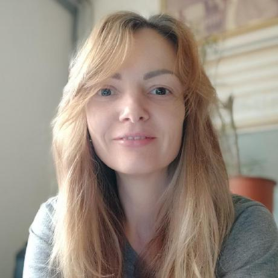

# Byte of Python (ukraine)

Це українське видання книги «A Byte of Python». Щиро вітаємо!
 
* Aвтор книги: Swaroop CH <https://www.swaroopch.com/>
  * Оригінал цієї книги (english): <https://python.swaroopch.com/>
* Перекладач: Daria JENS <https://https://github.com/Daria-Jens>
* Ліцензія цієї книги: creative-commons attribution share-alike 4.0 International (cc-by-sa 4.0) 
  * en: <https://creativecommons.org/licenses/by-sa/4.0/deed.en>
  * ukr: <https://creativecommons.org/licenses/by-sa/4.0/deed.uk>  
  * 

## Про цей переклад та про мене – коротка інформація для читачів

<!-- the 4 numbers are the number of columns on small, little, medium and large screen -->
:::::{grid} 1 2 2 2
:outline:
:gutter: 5

::::{grid-item}
<br>
_Дарія Йенс ([Daria JENS](https://www.linkedin.com/in/daria-jens-6b382a7/))_
::::
::::{grid-item}
:::{admonition} про мене
:class: tip dropdown

Мене звати Дарія Йенс (Daria JENS), я родом із Одеси, Україна.Маю вищу економічну освіту та 13 років професійного досвіду в Україні. У 2019 році я переїхала до Відня, Австрія, де розпочала вивчення мови програмування [Python](https://python.org), аби долучитися до [освітнього проєкту мого чоловіка з викладання Python](https://spielend-programmieren.at)
:::
:::{admonition} щодо цього перекладу
:class: tip dropdown

Під час вивчення Python я використовувала оригінальну книгу "A Byte of Python" від Swaroop  англійською мовою. Я знайшла кілька сайтів, які переклали окремі частини цієї книги українською, але повного перекладу не було, а також не було посилань на оригінальних авторів (Swaroop C H) чи на ліцензію Creative Commons Share-Alike.

Це мій перший переклад підручника з програмування, я додавала контент, коли це було необхідно для мого розуміння теми.

Якщо цей переклад буде корисний для вашого навчання, буду дуже рада отримати лист на адресу `jensdarya@gmail.com`. Якщо ви хочете допомогти покращити переклад, будь ласка, скористайтеся [кнопкою](https://docs.github.com/en/issues/tracking-your-work-with-issues/about-issues) у верхній частині кожної сторінки, щоб написати issue або надіслати [pull request](https://docs.github.com/en/pull-requests/collaborating-with-pull-requests/proposing-changes-to-your-work-with-pull-requests/about-pull-requests).
:::
::::
:::::

## Завантажити 

* Завантажити PDF версію : ( coming soon )
* Завантажити версію EPUB : ( coming soon )
* Переглянути веб-версію: <https://spielend-programmieren.at/byte_of_python_ukraine/>

## Зміст

```{toctree}
:maxdepth: 1
dedication_ukr.md
preface_ukr.md
about_python_ukr.md
installation_ukr.md
first_steps_ukr.md
basics_ukr.md
op_exp_ukr.md
control_flow_ukr.md
functions_ukr.md
modules_ukr.md
data_structures_ukr.md
problem_solving_ukr.md
oop_ukr.md
io_ukr.md
exceptions_ukr.md
stdlib_ukr.md
more_ukr.md
what_next_ukr.md
floss_ukr.md
about_ukr.md
revision_history_ukr.md
translations_ukr.md
translation_howto_ukr.md
feedback_ukr.md
```

