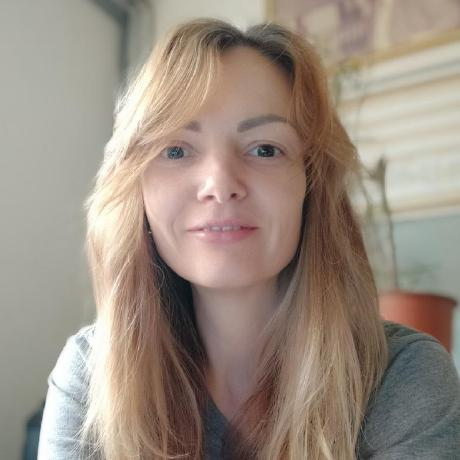

# A byte of Python (Ukraine)

* url: <https://spielend-programmieren.at/byte_of_python_ukraine/>
* Aвтор книги: Swaroop CH <https://www.swaroopch.com/>
  * Оригінал цієї книги (english): <https://python.swaroopch.com/>
* Перекладач: Daria JENS <https://https://github.com/Daria-Jens>

{w=200px}

_Дарія Йенс ([Daria JENS](https://www.linkedin.com/in/daria-jens-6b382a7/))_

{w=250px}

* Ліцензія цієї книги: creative-commons attribution share-alike 4.0 International (cc-by-sa 4.0)
  * en: <https://creativecommons.org/licenses/by-sa/4.0/deed.en>
  * ukr: <https://creativecommons.org/licenses/by-sa/4.0/deed.uk>  
  

## про мене

Мене звати Дарія Йенс (Daria JENS), я родом із Одеси, Україна.Маю вищу економічну освіту та 13 років професійного досвіду в Україні. У 2019 році я переїхала до Відня, Австрія, де розпочала вивчення мови програмування [Python](https://python.org), аби долучитися до [освітнього проєкту мого чоловіка з викладання Python](https://spielend-programmieren.at)

## щодо цього перекладу

Під час вивчення Python я використовувала оригінальну книгу "A Byte of Python" від Swaroop  англійською мовою. Я знайшла кілька сайтів, які переклали окремі частини цієї книги українською, але повного перекладу не було, а також не було посилань на оригінальних авторів (Swaroop C H) чи на ліцензію Creative Commons Share-Alike.

Це мій перший переклад підручника з програмування, я додавала контент, коли це було необхідно для мого розуміння теми.

Якщо цей переклад буде корисний для вашого навчання, буду дуже рада отримати лист на адресу `jensdarya@gmail.com`. Якщо ви хочете допомогти покращити переклад, будь ласка, скористайтеся [кнопкою](https://docs.github.com/en/issues/tracking-your-work-with-issues/about-issues) у верхній частині кожної сторінки, щоб написати issue або надіслати [pull request](https://docs.github.com/en/pull-requests/collaborating-with-pull-requests/proposing-changes-to-your-work-with-pull-requests/about-pull-requests).